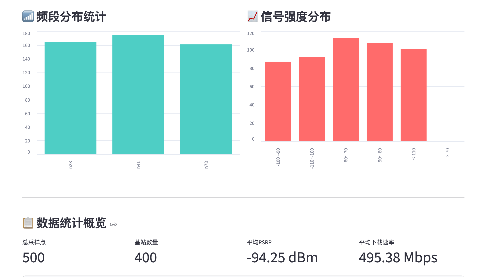
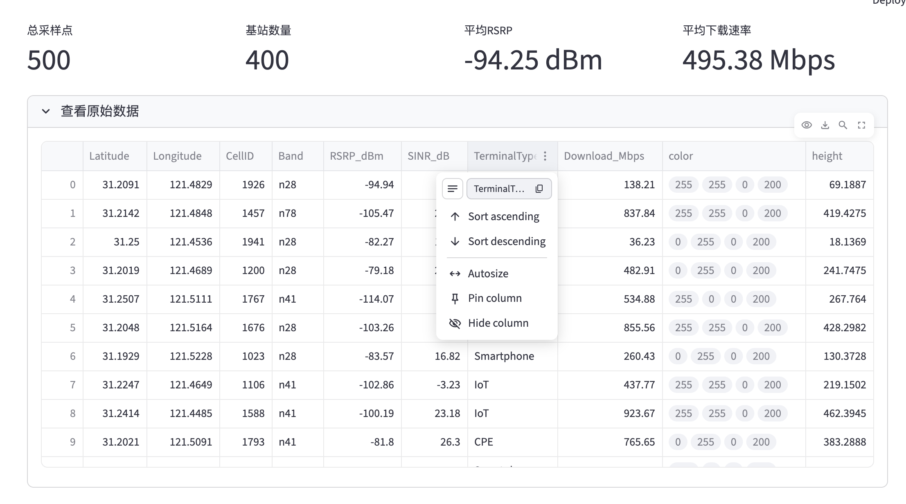

# 📡 5G 信号可视化看板

> **"Code with AI" 海选赛参赛作品 — Claude Code (DeepSeek V4) + Streamlit**
>
> 一个交互式 5G 路测信号可视化 Web 看板，支持 2D 热力散点图、3D 柱状地图、侧边栏实时联动筛选，以及完整单元测试。

## 项目概述

本项目是一款数据可视化应用，用于监控和分析 5G 网络信号质量。它提供交互式地图、3D 可视化和实时筛选功能，帮助用户直观了解不同频段基站的信号覆盖和性能表现。

## ✨ 功能特性

### 🟢 基础功能

| 功能 | 说明 |
|------|------|
| **数据加载** | 使用 pandas 读取 CSV 格式的信号样本数据 |
| **信号热力地图** | 使用 `st.map()` 渲染交互式 2D 地图 |
| **颜色编码** | RSRP 信号强度颜色编码显示 |
| **频段统计** | 柱状图展示各频段基站分布 |

### 🔵 进阶功能

| 功能 | 说明 |
|------|------|
| **侧边栏筛选** | 频段下拉 + RSRP 滑动条实时联动筛选 |
| **3D 可视化** | PyDeck 3D 柱状图（白色底图），高度随下载速率变化 |
| **数据统计** | 采样点、基站数、平均 RSRP、平均下载速率 |
| **原始数据** | 可展开的数据表格查看 |

### 📊 信号颜色编码

```
🟢 绿色  | RSRP > -90 dBm        | 信号强
🟡 黄色  | -110 ≤ RSRP ≤ -90 dBm  | 信号中等
🔴 红色  | RSRP < -110 dBm        | 信号弱
```

## 🛠️ 技术栈

| 技术 | 用途 |
|------|------|
| **Streamlit** | Web 应用框架 |
| **Pandas** | 数据处理与分析 |
| **PyDeck** | 3D 地图可视化 |
| **NumPy** | 数值计算 |
| **Pytest** | 单元测试 |

## 📥 安装

### 环境要求

- Python 3.8+
- pip

### 安装步骤

```bash
# 1. 克隆仓库
git clone https://github.com/your-repo/code-with-ai-contest.git
cd code-with-ai-contest

# 2. 创建并激活虚拟环境
python3 -m venv env
source env/bin/activate  # Linux/Mac
# env\Scripts\activate   # Windows

# 3. 安装依赖
pip install -r requirements.txt
```

### requirements.txt

```
streamlit>=1.28.0
pandas>=2.0.0
numpy>=1.24.0
pydeck>=0.8.0
pytest>=7.4.0
```

## 🚀 运行

### 启动应用

```bash
streamlit run app.py
```

看板访问地址：`http://localhost:8501`

### 运行测试

```bash
pytest test_app.py -v
```

## 📊 数据格式

应用期望 CSV 文件位于 `data/signal_samples.csv`，包含以下字段：

| 字段 | 类型 | 说明 |
|------|------|------|
| `Latitude` | float | 纬度 |
| `Longitude` | float | 经度 |
| `CellID` | int | 基站 ID |
| `Band` | string | 频段 (n28/n41/n78) |
| `RSRP_dBm` | float | 参考信号接收功率 (dBm) |
| `SINR_dB` | float | 信干噪比 (dB) |
| `TerminalType` | string | 终端类型 (Smartphone/CPE/IoT) |
| `Download_Mbps` | float | 下载速率 (Mbps) |

### 示例数据

```csv
Latitude,Longitude,CellID,Band,RSRP_dBm,SINR_dB,TerminalType,Download_Mbps
31.209143,121.482867,1926,n28,-94.94,5.44,Smartphone,138.21
31.214219,121.484829,1457,n78,-105.47,20.67,CPE,837.84
31.249965,121.453557,1941,n28,-82.27,18.28,Smartphone,36.23
```

## 📁 项目结构

```
code-with-ai-contest/
├── app.py                 # 主应用
├── test_app.py            # 单元测试
├── requirements.txt       # 依赖
├── README.md              # 项目文档
├── AI_PROMPTS.md          # AI 交互日志
├── data/
│   └── signal_samples.csv # 信号样本数据
└── screenshots/
    ├── 2D map.png         # 2D 信号热力地图
    ├── 3D map.png         # 3D 信号柱状图
    ├── chart.png          # 频段统计图表
    └── excel.png          # 原始数据视图
```

## 📸 运行截图

### 2D 信号热力地图


### 3D 信号柱状图


### 频段统计图表



### 原始数据视图



## 🧪 测试

### 运行所有测试

```bash
pytest test_app.py -v
```

### 测试覆盖

| 测试类 | 覆盖内容 |
|--------|----------|
| `TestDataLoading` | 数据加载与验证 (3 项) |
| `TestSignalColor` | 信号颜色映射逻辑 (5 项，含边界值) |
| `TestDataFiltering` | 数据筛选功能 (4 项) |

## 💡 参赛心得

本项目在 AI 辅助下完成开发，以下是关键心得：

### 1. 快速原型开发

AI 帮助我们快速生成初始应用结构和样板代码，使我们能够专注于核心可视化逻辑，而不是在重复代码模式上花费时间。

### 2. 迭代式改进

1. **描述需求** → AI 生成代码
2. **测试并发现问题** → 人工审查
3. **优化需求** → AI 改进代码
4. **重复**

### 3. 与 AI 协作的关键决策

| 决策 | 理由 |
|------|------|
| 使用 `@st.cache_data` | 缓存数据加载，提升性能 |
| PyDeck ColumnLayer 做 3D | 视觉效果和代码简洁性的最佳平衡 |
| 筛选函数独立封装 | 更好的代码组织和可测试性 |

### 4. 经验教训

1. **提示要具体**：清晰的需求会带来更好的 AI 生成代码
2. **始终审查 AI 输出**：AI 建议需要人工验证
3. **增量测试**：每次添加功能时都进行构建和测试
4. **记录决策**：跟踪选择特定方法的原因

## 📜 许可证

本项目为 "Code with AI" 编程大赛参赛作品。

---

**用心和 AI 共同打造**
